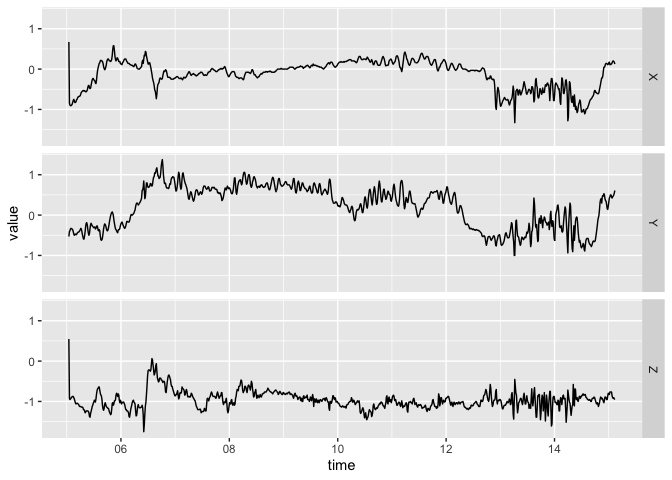

<!-- README.md is generated from README.Rmd. Please edit that file -->

# bis620.2022

<!-- badges: start -->

[](https://github.com/Gladys-Wang/bis620.2022/actions/workflows/R-CMD-check.yaml)
[](https://app.codecov.io/gh/Gladys-Wang/bis620.2022?branch=main)
[](https://github.com/Gladys-Wang/bis620.2022/actions/workflows/test-coverage.yaml)
[](https://github.com/Gladys-Wang/bis620.2022/actions/workflows/lint.yaml)
<!-- badges: end -->

## Installation

You can install the development version of bis620.2022 from
[GitHub](https://github.com/) with:

``` r
# install.packages("devtools")
devtools::install_github("Gladys-Wang/bis620.2022")
```

# Description

The goal of bis620.2022 is to incorporate several packages so that you
could invoke them in R and also from github.

The accel_plot is a function to generate plots of time series data with
time or frequency on the x-axis. You could implement it by calling:

``` r
library(bis620.2022)
data(ukb_accel)
accel_plot(ukb_accel[1:1000,])
```

 The
spectral_signature is a function that generates a dataframe by adding a
frequency column to time series data. You could implement it by calling:

``` r
data(ukb_accel)
spectral_signature(ukb_accel[1:1000,])
#> # A tibble: 500 × 4
#>        X     Y      Z   freq
#>    <dbl> <dbl>  <dbl>  <dbl>
#>  1 127.  214.  962.   0.0993
#>  2 144.  289.   55.8  0.0995
#>  3 124.   63.9  33.4  0.0997
#>  4  42.5  55.3   9.06 0.0999
#>  5  18.4 106.   36.6  0.100 
#>  6  45.7  24.2  48.7  0.100 
#>  7  21.6  60.6  34.5  0.100 
#>  8  26.5  71.9  28.5  0.101 
#>  9  44.6  16.0  19.5  0.101 
#> 10  46.9  25.5  23.0  0.101 
#> # … with 490 more rows
```
